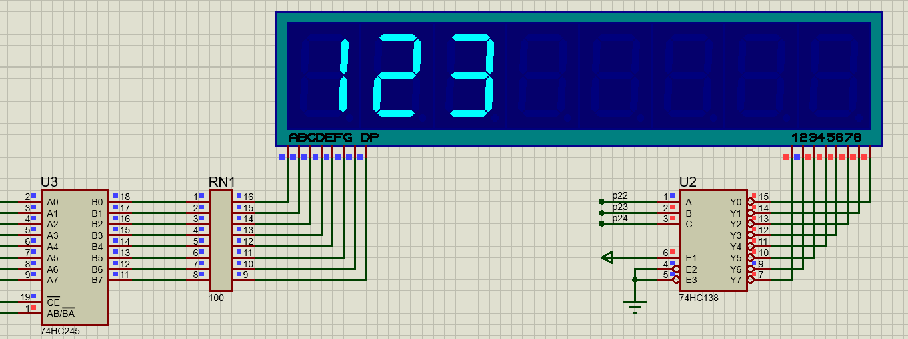
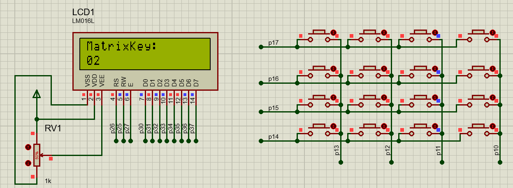
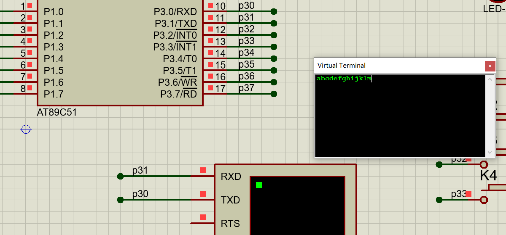
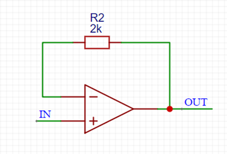
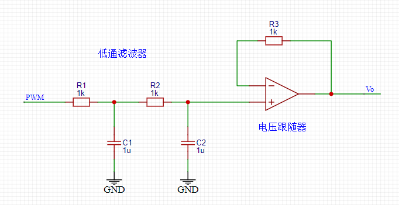
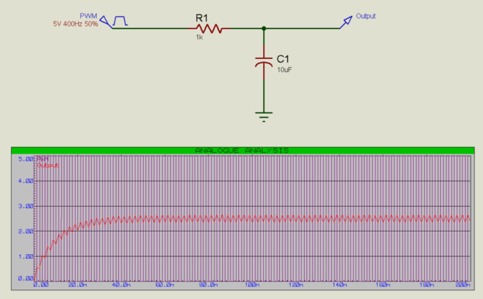
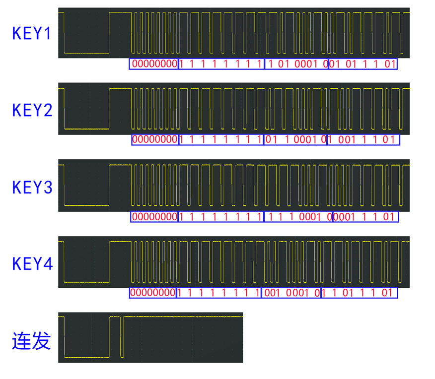

# lit led

```c
#include <REGX52.H>

void main()
{
	P2 = 0xFE; // 1111 1110
    // 点亮led p20;
	while (1)
	{
	}
}
```

# led flicker

stc-isp -> 软件延时计算器


> main c

```c
#include <REGX52.H>
#include <INTRINS.H>

void Delay500us()		//@12.000MHz
{
	unsigned char i, j;

	i = 6;
	j = 211;
	do
	{
		while (--j);
	} while (--i);
}


void main()
{
	
	while (1)
	{
		Delay500us();
		P2 = 0xFE; // 1111 1110
		Delay500us();
		P2 = 0xFF; // 1111 1110
	}
}
```

# led water lamp


```c
#include <REGX52.H>

void Delay1ms(unsigned int xms);		//@12.000MHz

void main()
{
	while(1)
	{
		P2=0xFE;//1111 1110
		Delay1ms(1000);
		P2=0xFD;//1111 1101
		Delay1ms(1000);
		P2=0xFB;//1111 1011
		Delay1ms(100);
		P2=0xF7;//1111 0111
		Delay1ms(100);
		P2=0xEF;//1110 1111
		Delay1ms(100);
		P2=0xDF;//1101 1111
		Delay1ms(100);
		P2=0xBF;//1011 1111
		Delay1ms(100);
		P2=0x7F;//0111 1111
		Delay1ms(100);
	}
}

void Delay1ms(unsigned int xms)		//@12.000MHz
{
	unsigned char i, j;
	while(xms)
	{
		i = 2;
		j = 239;
		do
		{
			while (--j);
		} while (--i);
		xms--;
	}
}
```

# button control LED status

```c
#include <REGX52.H>

void Delay(unsigned int xms)
{
	unsigned char i, j;
	while(xms)
	{
		i = 2;
		j = 239;
		do
		{
			while (--j);
		} while (--i);
		xms--;
	}
}

void main()
{
	while(1)
	{
		if(P3_1==0)			//如果K1按键按下
		{
			Delay(20);		//延时消抖
			while(P3_1==0);	//松手检测
			Delay(20);		//延时消抖
			
			P2_0=~P2_0;		//LED1取反
		}
	}
}
```

# led lamp show binary val


```c
#include <REGX52.H>

void Delay(unsigned int xms)
{
	unsigned char i, j;
	while(xms--)
	{
		i = 2;
		j = 239;
		do
		{
			while (--j);
		} while (--i);
	}
}

void main()
{
	unsigned char LEDNum=0;
	while(1)
	{
		if(P3_1==0)			//如果K1按键按下
		{
			Delay(20);		//延时消抖
			while(P3_1==0);	//松手检测
			Delay(20);		//延时消抖
			
			LEDNum++;		//变量自增
			P2=~LEDNum;		//变量取反输出给LED
		}
	}
}
```

# Button control flashing led shift


```c
#include <REGX52.H>
void Delay(unsigned int xms);

unsigned char LEDNum;

void main()
{
	P2=~0x01;				//上电默认LED1点亮
	while(1)
	{
		if(P3_1==0)			//如果K1按键按下
		{
			Delay(20);
			while(P3_1==0);
			Delay(20);
			
			LEDNum++;		//LEDNum自增
			if(LEDNum>=8)	//限制LEDNum自增范围
				LEDNum=0;
			P2=~(0x01<<LEDNum);	//LED的第LEDNum位点亮
		}
		if(P3_0==0)			//如果K2按键按下
		{
			Delay(20);
			while(P3_0==0);
			Delay(20);
			
			if(LEDNum==0)	//LEDNum减到0后变为7
				LEDNum=7;
			else			//LEDNum未减到0，自减
				LEDNum--;
			P2=~(0x01<<LEDNum);	//LED的第LEDNum位点亮
		}
	}
}

void Delay(unsigned int xms)
{
	unsigned char i, j;
	while(xms--)
	{
		i = 2;
		j = 239;
		do
		{
			while (--j);
		} while (--i);
	}
}
```

# Nixie display


```c
#include <REGX52.H>

//数码管段码表
unsigned char NixieTable[]={0x3F,0x06,0x5B,0x4F,0x66,0x6D,0x7D,0x07,0x7F,0x6F};

//数码管显示子函数
void Nixie(unsigned char Location,Number)
{
	switch(Location)		//位码输出
	{
		case 1:P2_4=1;P2_3=1;P2_2=1;break;
		case 2:P2_4=1;P2_3=1;P2_2=0;break;
		case 3:P2_4=1;P2_3=0;P2_2=1;break;
		case 4:P2_4=1;P2_3=0;P2_2=0;break;
		case 5:P2_4=0;P2_3=1;P2_2=1;break;
		case 6:P2_4=0;P2_3=1;P2_2=0;break;
		case 7:P2_4=0;P2_3=0;P2_2=1;break;
		case 8:P2_4=0;P2_3=0;P2_2=0;break;
	}
	P3=NixieTable[Number];	//段码输出
}

void main()
{
	Nixie(2,3);	//在数码管的第2位置显示3
	while(1)
	{
		
	}
}
```

# Dynamic nixie display



```c
#include <REGX52.H>

//数码管段码表
unsigned char NixieTable[]={0x3F,0x06,0x5B,0x4F,0x66,0x6D,0x7D,0x07,0x7F,0x6F};

//延时子函数
void Delay(unsigned int xms)
{
	unsigned char i, j;
	while(xms--)
	{
		i = 2;
		j = 239;
		do
		{
			while (--j);
		} while (--i);
	}
}

//数码管显示子函数
void Nixie(unsigned char Location,Number)
{
	switch(Location)		//位码输出
	{
		case 1:P2_4=1;P2_3=1;P2_2=1;break;
		case 2:P2_4=1;P2_3=1;P2_2=0;break;
		case 3:P2_4=1;P2_3=0;P2_2=1;break;
		case 4:P2_4=1;P2_3=0;P2_2=0;break;
		case 5:P2_4=0;P2_3=1;P2_2=1;break;
		case 6:P2_4=0;P2_3=1;P2_2=0;break;
		case 7:P2_4=0;P2_3=0;P2_2=1;break;
		case 8:P2_4=0;P2_3=0;P2_2=0;break;
	}
	P3=NixieTable[Number];	//段码输出
	Delay(1);				//显示一段时间
	P3=0x00;				//段码清0，消影
}

void main()
{
	while(1)
	{
		Nixie(1,1);		//在数码管的第1位置显示1
//		Delay(20);
		Nixie(2,2);		//在数码管的第2位置显示2
//		Delay(20);
		Nixie(3,3);		//在数码管的第3位置显示3
//		Delay(20);
	}
}
```

# lcd1602 debugging tool


| **引脚** | **功能**                                                |
| -------- | ------------------------------------------------------- |
| VSS      | 地                                                      |
| VDD      | 电源正极（4.5~5.5V）                                    |
| VEE      | 对比度调节电压                                          |
| RS       | 数据/指令选择，1为数据，0为指令                         |
| RW       | 读/写选择，1为读，0为写                                 |
| E        | 使能，1为数据有效，下降沿执行命令(数据先挂载到数据线中) |
| D0~D7    | 数据输入/输出                                           |
| A        | 背光灯电源正极                                          |
| K        | 背光灯电源负极                                          |


> main c 

```c
#include <REGX52.H>
#include "LCD1602.h"	//包含LCD1602头文件
#include "Delay.h"		//包含Delay头文件

int Result=0;

void main()
{
	LCD_Init();
	while(1)
	{
		Result++;					//Result自增
		Delay(500);				//延时0.5秒
		LCD_ShowNum(1,1,Result,3);	//在LCD的1行1列显示Result，长度为3位
	}
}
```

> delay h

```c
#ifndef __DELAY_H__
#define __DELAY_H__

void Delay(unsigned int xms);

#endif
```

> delay c

```c

void Delay(unsigned int xms)
{
	unsigned char i, j;
	while(xms--)
	{
		i = 2;
		j = 239;
		do
		{
			while (--j);
		} while (--i);
	}
}
```

> lcd 1602 h

```c
#ifndef __LCD1602_H__
#define __LCD1602_H__

//用户调用函数：
void LCD_Init();
void LCD_ShowChar(unsigned char Line,unsigned char Column,char Char);
void LCD_ShowString(unsigned char Line,unsigned char Column,char *String);
void LCD_ShowNum(unsigned char Line,unsigned char Column,unsigned int Number,unsigned char Length);
void LCD_ShowSignedNum(unsigned char Line,unsigned char Column,int Number,unsigned char Length);
void LCD_ShowHexNum(unsigned char Line,unsigned char Column,unsigned int Number,unsigned char Length);
void LCD_ShowBinNum(unsigned char Line,unsigned char Column,unsigned int Number,unsigned char Length);

#endif
```


> cd 1602 c

```c
#include <REGX52.H>

//引脚配置：
sbit LCD_RS=P2^6;
sbit LCD_RW=P2^5;
sbit LCD_EN=P2^7;
#define LCD_DataPort P3

//函数定义：
/**
  * @brief  LCD1602延时函数，12MHz调用可延时1ms
  * @param  无
  * @retval 无
  */
void LCD_Delay()
{
	unsigned char i, j;

	i = 2;
	j = 239;
	do
	{
		while (--j);
	} while (--i);
}

/**
  * @brief  LCD1602写命令
  * @param  Command 要写入的命令
  * @retval 无
  */
void LCD_WriteCommand(unsigned char Command)
{
    // 指令模式，写操作
	LCD_RS=0;
	LCD_RW=0;
    
	LCD_DataPort=Command;
    
    // 先将电平拉高，然后产生下降沿使其执行指令
	LCD_EN=1;
	LCD_Delay();
	LCD_EN=0;
	LCD_Delay();
}

/**
  * @brief  LCD1602写数据
  * @param  Data 要写入的数据
  * @retval 无
  */
void LCD_WriteData(unsigned char Data)
{
    // 数据模式、写操作
	LCD_RS=1;
	LCD_RW=0;
    
	LCD_DataPort=Data;
    
    // 先将电平拉高，然后产生下降沿使其执行指令
	LCD_EN=1;
	LCD_Delay();
	LCD_EN=0;
	LCD_Delay();
}

/**
  * @brief  LCD1602设置光标位置
  * @param  Line 行位置，范围：1~2
  * @param  Column 列位置，范围：1~16
  * @retval 无
  */
void LCD_SetCursor(unsigned char Line,unsigned char Column)
{
    // 对于传入的line和column，都是通过一通过1来作为基地址
	if(Line==1)
	{
		LCD_WriteCommand(0x80|(Column-1));
	}
	else if(Line==2)
	{
		LCD_WriteCommand(0x80|(Column-1+0x40));
	}
}

/**
  * @brief  LCD1602初始化函数
  * @param  无
  * @retval 无
  */
void LCD_Init()
{
	LCD_WriteCommand(0x38);//八位数据接口，两行显示，5*7点阵
	LCD_WriteCommand(0x0c);//显示开，光标关，闪烁关
	LCD_WriteCommand(0x06);//数据读写操作后，光标自动加一，画面不动
	LCD_WriteCommand(0x01);//光标复位，清屏
}

/**
  * @brief  在LCD1602指定位置上显示一个字符
  * @param  Line 行位置，范围：1~2
  * @param  Column 列位置，范围：1~16
  * @param  Char 要显示的字符
  * @retval 无
  */
void LCD_ShowChar(unsigned char Line,unsigned char Column,char Char)
{
	LCD_SetCursor(Line,Column);
	LCD_WriteData(Char);
}

/**
  * @brief  在LCD1602指定位置开始显示所给字符串
  * @param  Line 起始行位置，范围：1~2
  * @param  Column 起始列位置，范围：1~16
  * @param  String 要显示的字符串
  * @retval 无
  */
void LCD_ShowString(unsigned char Line,unsigned char Column,char *String)
{
	unsigned char i;
	LCD_SetCursor(Line,Column);
	for(i=0;String[i]!='\0';i++)
	{
		LCD_WriteData(String[i]);
	}
}

/**
  * @brief  返回值=X的Y次方
  */
int LCD_Pow(int X,int Y)
{
	unsigned char i;
	int Result=1;
	for(i=0;i<Y;i++)
	{
		Result*=X;
	}
	return Result;
}

/**
  * @brief  在LCD1602指定位置开始显示所给数字
  * @param  Line 起始行位置，范围：1~2
  * @param  Column 起始列位置，范围：1~16
  * @param  Number 要显示的数字，范围：0~65535
  * @param  Length 要显示数字的长度，范围：1~5
  * @retval 无
  */
void LCD_ShowNum(unsigned char Line,unsigned char Column,unsigned int Number,unsigned char Length)
{
	unsigned char i;
	LCD_SetCursor(Line,Column);
	for(i=Length;i>0;i--)
	{
		LCD_WriteData(Number/LCD_Pow(10,i-1)%10+'0');
	}
}

/**
  * @brief  在LCD1602指定位置开始以有符号十进制显示所给数字
  * @param  Line 起始行位置，范围：1~2
  * @param  Column 起始列位置，范围：1~16
  * @param  Number 要显示的数字，范围：-32768~32767
  * @param  Length 要显示数字的长度，范围：1~5
  * @retval 无
  */
void LCD_ShowSignedNum(unsigned char Line,unsigned char Column,int Number,unsigned char Length)
{
	unsigned char i;
	unsigned int Number1;
	LCD_SetCursor(Line,Column);
	if(Number>=0)
	{
		LCD_WriteData('+');
		Number1=Number;
	}
	else
	{
		LCD_WriteData('-');
		Number1=-Number;
	}
	for(i=Length;i>0;i--)
	{
		LCD_WriteData(Number1/LCD_Pow(10,i-1)%10+'0');
	}
}

/**
  * @brief  在LCD1602指定位置开始以十六进制显示所给数字
  * @param  Line 起始行位置，范围：1~2
  * @param  Column 起始列位置，范围：1~16
  * @param  Number 要显示的数字，范围：0~0xFFFF
  * @param  Length 要显示数字的长度，范围：1~4
  * @retval 无
  */
void LCD_ShowHexNum(unsigned char Line,unsigned char Column,unsigned int Number,unsigned char Length)
{
	unsigned char i,SingleNumber;
	LCD_SetCursor(Line,Column);
	for(i=Length;i>0;i--)
	{
		SingleNumber=Number/LCD_Pow(16,i-1)%16;
		if(SingleNumber<10)
		{
			LCD_WriteData(SingleNumber+'0');
		}
		else
		{
			LCD_WriteData(SingleNumber-10+'A');
		}
	}
}

/**
  * @brief  在LCD1602指定位置开始以二进制显示所给数字
  * @param  Line 起始行位置，范围：1~2
  * @param  Column 起始列位置，范围：1~16
  * @param  Number 要显示的数字，范围：0~1111 1111 1111 1111
  * @param  Length 要显示数字的长度，范围：1~16
  * @retval 无
  */
void LCD_ShowBinNum(unsigned char Line,unsigned char Column,unsigned int Number,unsigned char Length)
{
	unsigned char i;
	LCD_SetCursor(Line,Column);
	for(i=Length;i>0;i--)
	{
		LCD_WriteData(Number/LCD_Pow(2,i-1)%2+'0');
	}
}
```

# Matrix keyboard scan




> main c

```c
#include <REGX52.H>
#include "Delay.h"		//包含Delay头文件
#include "LCD1602.h"	//包含LCD1602头文件
#include "MatrixKey.h"	//包含矩阵键盘头文件

unsigned char KeyNum;

void main()
{
	LCD_Init();							//LCD初始化
	LCD_ShowString(1,1,"MatrixKey:");	//LCD显示字符串
	while(1)
	{
		KeyNum=MatrixKey();				//获取矩阵键盘键码
		if(KeyNum)						//如果有按键按下
		{
			LCD_ShowNum(2,1,KeyNum,2);	//LCD显示键码
		}
	}
}
```

> matrix key h

```c
#ifndef __MATRIXKEY_H__
#define __MATRIXKEY_H__

unsigned char MatrixKey();

#endif
```

> matrix key c

```c
#include <REGX52.H>
#include "Delay.h"

/**
  * @brief  矩阵键盘读取按键键码
  * @param  无
  * @retval KeyNumber 按下按键的键码值
			如果按键按下不放，程序会停留在此函数，松手的一瞬间，返回按键键码，没有按键按下时，返回0
  */
unsigned char MatrixKey()
{
	unsigned char KeyNumber=0;
	
	P1=0xFF;
	P1_3=0;
	if(P1_7==0){Delay(20);while(P1_7==0);Delay(20);KeyNumber=1;}
	if(P1_6==0){Delay(20);while(P1_6==0);Delay(20);KeyNumber=5;}
	if(P1_5==0){Delay(20);while(P1_5==0);Delay(20);KeyNumber=9;}
	if(P1_4==0){Delay(20);while(P1_4==0);Delay(20);KeyNumber=13;}
	
	P1=0xFF;
	P1_2=0;
	if(P1_7==0){Delay(20);while(P1_7==0);Delay(20);KeyNumber=2;}
	if(P1_6==0){Delay(20);while(P1_6==0);Delay(20);KeyNumber=6;}
	if(P1_5==0){Delay(20);while(P1_5==0);Delay(20);KeyNumber=10;}
	if(P1_4==0){Delay(20);while(P1_4==0);Delay(20);KeyNumber=14;}
	
	P1=0xFF;
	P1_1=0;
	if(P1_7==0){Delay(20);while(P1_7==0);Delay(20);KeyNumber=3;}
	if(P1_6==0){Delay(20);while(P1_6==0);Delay(20);KeyNumber=7;}
	if(P1_5==0){Delay(20);while(P1_5==0);Delay(20);KeyNumber=11;}
	if(P1_4==0){Delay(20);while(P1_4==0);Delay(20);KeyNumber=15;}
	
	P1=0xFF;
	P1_0=0;
	if(P1_7==0){Delay(20);while(P1_7==0);Delay(20);KeyNumber=4;}
	if(P1_6==0){Delay(20);while(P1_6==0);Delay(20);KeyNumber=8;}
	if(P1_5==0){Delay(20);while(P1_5==0);Delay(20);KeyNumber=12;}
	if(P1_4==0){Delay(20);while(P1_4==0);Delay(20);KeyNumber=16;}
	
	return KeyNumber;
}
```

# Password lock example


> main c 

```c
#include <REGX52.H>
#include "Delay.h"
#include "LCD1602.h"
#include "MatrixKey.h"

unsigned char KeyNum;
unsigned int Password,Count;

void main()
{
	LCD_Init();
	LCD_ShowString(1,1,"Password:");
	while(1)
	{
		KeyNum=MatrixKey();
		if(KeyNum)
		{
			if(KeyNum<=10)	//如果S1~S10按键按下，输入密码
			{
				if(Count<4)	//如果输入次数小于4
				{
					Password*=10;				//密码左移一位
					Password+=KeyNum%10;		//获取一位密码
					Count++;	//计次加一
				}
				LCD_ShowNum(2,1,Password,4);	//更新显示
			}
			if(KeyNum==11)	//如果S11按键按下，确认
			{
				if(Password==2345)	//如果密码等于正确密码
				{
					LCD_ShowString(1,14,"OK ");	//显示OK
					Password=0;		//密码清零
					Count=0;		//计次清零
					LCD_ShowNum(2,1,Password,4);	//更新显示
				}
				else				//否则
				{
					LCD_ShowString(1,14,"ERR");	//显示ERR
					Password=0;		//密码清零
					Count=0;		//计次清零
					LCD_ShowNum(2,1,Password,4);	//更新显示
				}
			}
			if(KeyNum==12)	//如果S12按键按下，取消
			{
				Password=0;		//密码清零
				Count=0;		//计次清零
				LCD_ShowNum(2,1,Password,4);	//更新显示
			}
		}
	}
}
```

# Timer theory

## main theory

定时器是单片机中常用的功能模块之一，用于生成一定时间间隔的定时脉冲或者实现时间测量。STC89C52的定时器采用基于晶振频率的时钟源，并具有可编程的分频器。

STC89C52中有两个定时器，分别是定时器0（T0）和定时器1（T1）。这两个定时器可以用于不同的应用场景。

## Timer principle

1. **定时器0（T0）：**
   - 定时器0是一个可编程的 16 位定时器/计数器。
   - 工作模式有两种：定时模式和计数模式。
   - 在定时模式下，T0 可以作为定时器使用，产生一定时间间隔的中断。用户可以设置初始值，当计数器计数到0时，产生中断。
   - 在计数模式下，T0 可以用作外部事件的计数器。

2. **定时器1（T1）：**
   - 定时器1也是一个可编程的 16 位定时器/计数器。
   - 与定时器0类似，T1 有定时模式和计数模式。
   - T1 可以单独工作，也可以和定时器0一起工作。在同时工作时，它们可以协同产生精确的定时脉冲。

## Timer configuration and control

1. **时钟源选择：**
   - 定时器的工作需要时钟源，STC89C52支持不同的时钟源选择，可以是外部晶振、系统时钟等。
2. **模式选择：**
   - 用户可以选择定时模式还是计数模式
       - 模式0∶13位定时器/计数器
       - 模式1∶16位定时器/计数器（常用)
       - 模式2∶8位自动重装模式
       - 模式3∶两个8位计数器
3. **分频器设置：**
   - 定时器的时钟频率可以通过设置分频器的值进行调节，从而控制定时器的计数速度。
4. **中断控制：**
   - 定时器计数完成时，可以产生中断请求，通知CPU执行相应的中断服务程序。
5. **定时器的控制寄存器：**
   - TCON 寄存器和 TMOD 寄存器用于控制定时器的工作模式和状态。

## 16-bit counter working diagram


## Pseudo-code example

以下是使用定时器0产生一秒钟定时中断的简单示例：

```c
#include <reg52.h>

// 定时器0被设置为工作方式1，每隔1ms产生一次中断.
void Timer0_Init() {
    TMOD |= 0x01;  // 设置定时器0为工作方式1，16位自动重载模式
    
    TH0 = 0xFC;    // 初始值，定时1ms（假设晶振频率为12MHz）
    TL0 = 0x66;
    
    ET0 = 1;       // 允许定时器0中断
    EA = 1;        // 允许总中断
    
    TR0 = 1;       // 启动定时器0
}

void Timer0_ISR() interrupt 1 {
    // 定时器0中断服务程序
    // 在这里可以执行定时任务
}

void main() {
    Timer0_Init();

    while (1) {
        // 主程序
    }
}
```

## Timing determination

1. **晶振频率：** 假设晶振频率为12MHz。

2. **定时器工作方式：** `TMOD |= 0x01;` 设置定时器0为工作方式1，16位自动重载模式。

3. **初始值：**
   
   - `TH0 = 0xFC;` 和 `TL0 = 0x66;` 设置定时器0的初始值。由于定时器0是16位的，TH0 和 TL0 组成一个16位的初值。通过设定这两个寄存器的值，可以控制定时器的初值，从而控制定时器的计数范围。
   - 由于计时是16位的，所以定时范围为 0x66FC 到 0xFFFF。
   
4. **计算定时周期：**
   
   - 定时周期 = (65536 - 初始值) * 晶振周期 * 分频系数
   - 分频系数是根据工作方式设置的，由于工作方式1是16位自动重载模式，所以分频系数是1。
   
   将上述数值代入计算：
   - 定时周期 = (65536 - 0x66FC) * (1 / 12MHz) * 1
              ≈ 0.001 秒
   
5. **计算定时中断频率：**
   
   - 定时中断频率 = 1 / 定时周期
   - 定时中断频率 = 1 / 0.001
                  = 1000 Hz

STC89C52是一款基于8051架构的单片机，具有中断系统用于处理外部事件。以下是关于STC89C52中中断的原理和工作方式的描述：

# Interrupt theory

## Interrupt principle

中断是一种机制，允许单片机在执行程序的过程中，对外部事件作出响应。当发生特定事件时，中断机制能够使处理器立即暂停当前执行的程序，转而执行与中断相关的一段特定代码，称为中断服务程序（ISR）。中断可以分为外部中断和定时器中断等多种类型。

## Interrupt mode

1. **中断向量表：**
   - STC89C52的中断系统采用中断向量表的方式。当发生中断时，处理器会根据中断类型查找中断向量表，找到对应中断服务程序的入口地址。
2. **中断控制器：**
   - STC89C52中，中断控制寄存器（`IE`）用于允许或禁止不同类型的中断。通过设置`IE`寄存器的不同位，可以开启或关闭外部中断、定时器中断等。
3. **中断优先级：**
   - 通过设置`IP`寄存器，可以控制不同中断的优先级。`IP`寄存器的位对应于不同的中断类型。
4. **中断请求标志：**
   - 当一个中断事件发生时，相应的中断请求标志会被置位，向处理器表明中断事件已经发生。
5. **中断触发条件：**
   - 外部中断通常在引脚上检测到电平或边沿变化时触发。
   - 定时器中断则是根据定时器溢出或计数值达到设定值时触发。
6. **中断服务程序（ISR）：**
   - 中断服务程序是在中断触发时执行的一段代码。在STC89C52中，用户需要编写中断服务程序来处理中断事件。

## Interrupt work diagram


## Pseudo-code example

以下是一个简单的例子，演示如何在STC89C52中使用外部中断（INT0）：

```c
#include <reg52.h>

void ExternalInterrupt_Init() {
    // 设置外部中断0（INT0）为下降沿触发
    IT0 = 1;

    // 允许外部中断0
    EX0 = 1;

    // 允许总中断
    EA = 1;
    
    // 定时器0中断的优先级（设定为低优先级）
    PT0 = 0;        
}

void ExternalInterrupt0_ISR() interrupt 0 {
    // 外部中断0中断服务程序
    // 在这里执行中断触发时需要进行的操作
}

void main() {
    ExternalInterrupt_Init();

    while (1) {
        // 主程序
    }
}
```

当外部中断0引脚检测到下降沿时，会触发中断0。在中断服务程序中，你可以编写代码来处理这个外部中断事件。

# Timer flow lamp


> main c

```c
#include <REGX52.H>
#include "timer.h"
#include "keys.h"
#include <INTRINS.H>

unsigned char KeyNum,LEDMode;

void main()
{
	P2=0xFE; // 点亮第一个led
	Timer0Init();
	
	LEDMode = 0; // 设置流水灯的显示模式为0
	// 在这里定义两种显示模式，分别是 0 和 1
	
	while(1)
	{
		KeyNum=Key();		//获取独立按键键码
		if(KeyNum)			//如果按键按下
		{
			if(KeyNum==1)	//如果K1按键按下
			{
				if (LEDMode == 0){
					LEDMode = 1;
				}else if (LEDMode == 1){
					LEDMode = 0;
				}
			}
		}
	}
}

// 定时器中断代码
void Timer0_Routine() interrupt 1
{
	static unsigned int T0Counter;
	TL0 = 0x18;		//设置定时初值
	TH0 = 0xFC;		//设置定时初值
	
	T0Counter++;		//T0Count计次，对中断频率进行分频
	
	if(T0Counter >= 500)//分频500次，500ms
	{
		T0Counter = 0; // 清空计数器
		
		if(LEDMode==0)			//模式判断
			// 用于将 P2 寄存器中的位进行循环左移（Rotate Left）
			P2=_crol_(P2,1);	//LED输出
		if(LEDMode==1)
			//使用了 Keil C51 编译器中的 _cror_ 宏，
			// 用于将 P2 寄存器中的位进行循环右移（Rotate Right）
			P2=_cror_(P2,1); 
	}
}
```

> keys h 

```c
#ifndef __KEYS_H__
#define __KEYS_H__

unsigned char Key();

#endif
```

> keys c

```c
#include <REGX52.H>
#include "Delay.h"

/**
  * @brief  获取独立按键键码
  * @param  无
  * @retval 按下按键的键码，范围：0~4，无按键按下时返回值为0
  */
unsigned char Key()
{
	unsigned char KeyNumber=0;
	
	if(P3_1==0){Delay(20);while(P3_1==0);Delay(20);KeyNumber=1;}
	if(P3_0==0){Delay(20);while(P3_0==0);Delay(20);KeyNumber=2;}
	if(P3_2==0){Delay(20);while(P3_2==0);Delay(20);KeyNumber=3;}
	if(P3_3==0){Delay(20);while(P3_3==0);Delay(20);KeyNumber=4;}
	
	return KeyNumber;
}
```

> timer h

```c
#ifndef __TIMER_H__
#define __TIMER_H__

void Timer0Init(void);

#endif
```

> timer c 

```c
#include <REGX52.H>

/**
  * @brief  定时器0初始化，1毫秒@12.000MHz
  * @param  无
  * @retval 无
  */
void Timer0Init(void)
{
	TMOD &= 0xF0;		//设置定时器模式
	TMOD |= 0x01;		//设置定时器模式
	TL0 = 0x18;		//设置定时初值
	TH0 = 0xFC;		//设置定时初值
	TF0 = 0;		//清除TF0标志
	TR0 = 1;		//定时器0开始计时
	ET0=1;
	EA=1;
	PT0=0;
}

/*定时器中断函数模板
void Timer0_Routine() interrupt 1
{
	static unsigned int T0Count;
	TL0 = 0x18;		//设置定时初值
	TH0 = 0xFC;		//设置定时初值
	T0Count++;
	if(T0Count>=1000)
	{
		T0Count=0;
		
	}
}
*/
```

初始化定时器0。

1. `TMOD &= 0xF0;`：将 TMOD 寄存器的低四位清零，保留高四位。用于清除原来的定时器模式设置。
2. `TMOD |= 0x01;`：将 TMOD 寄存器的低四位的最低位设置为1，将其余三位保持为0。设置定时器0为工作方式1，即16位定时器模式。
3. `TL0 = 0x18;` 和 `TH0 = 0xFC;`：设置定时器初值。这里设定了一个初始值，根据实际需求可调整。
4. `TF0 = 0;`：清除定时器0的溢出标志位，以确保在启动定时器后不会立即触发中断。
5. `TR0 = 1;`：启动定时器0，开始计时。
6. `ET0 = 1;`：允许定时器0中断。
7. `EA = 1;`：允许总中断。
8. `PT0 = 0;`：定时器0中断的优先级。这里设置为低优先级。

# Timer alarm clock


> main c

```c
#include <REGX52.H>
#include "delay.h"
#include "lcd1602.h"
#include "timer.h"

unsigned char Sec, Min, Hour;

void main()
{
	Sec = 34;
	Min = 26;
	Hour = 8;
	LCD_Init();
	Timer0Init();
	
	LCD_ShowString(1,1,"Clock:");	//上电显示静态字符串
	LCD_ShowString(2,1,"  :  :");
	
	while(1)
	{
		LCD_ShowNum(2,1,Hour,2);	//显示时分秒
		LCD_ShowNum(2,4,Min,2);
		LCD_ShowNum(2,7,Sec,2);
	}
}

void Timer0_Routine() interrupt 1
{
	static unsigned int T0Counter;
	TL0 = 0x18;		//设置定时初值
	TH0 = 0xFC;		//设置定时初值
	T0Counter++;
	if(T0Counter>=1000)	//定时器分频，1s
	{
		T0Counter=0;
		Sec++;			//1秒到，Sec自增
		if(Sec>=60)
		{
			Sec=0;		//60秒到，Sec清0，Min自增
			Min++;
			if(Min>=60)
			{
				Min=0;	//60分钟到，Min清0，Hour自增
				Hour++;
				if(Hour>=24)
				{
					Hour=0;	//24小时到，Hour清0
				}
			}
		}
	}
}
```

# Serial communication theory

串口通信是一种通过串行线路（单一数据线）进行数据传输的通信方式。在这种通信方式中，数据位按照顺序一个接一个地被发送或接收。通常，串口通信涉及两个设备之间的数据传输，其中一个设备负责发送数据，而另一个设备负责接收数据。

以下是串口通信的基本原理：

1. **数据帧：** 串口通信中的数据被组织成一系列的数据帧，每个数据帧包含了一定的信息。一个数据帧通常包括起始位、数据位、可选的校验位和停止位。起始位和停止位之间的位数表示数据位的数量。

2. **波特率：** 波特率是衡量串口通信速度的参数，表示每秒传输的比特数。在通信的两端，必须设置相同的波特率，以确保数据的正确传输。上述提到的代码中，通过配置定时器1的初值和重装值，实现了波特率为4800 bps。

3. **起始位和停止位：** 起始位表示数据帧的开始，通常为逻辑0。停止位标志着数据帧的结束，通常为逻辑1。这两个位的目的是为了让接收设备能够正确地同步和定位数据帧。

4. **数据传输：** 发送端通过串行线路逐位地发送数据帧。接收端根据设置的波特率逐位地接收数据。接收设备通过检测起始位、读取数据位、检测校验位（如果有的话）和停止位，来解析接收到的数据。

5. **异步和同步通信：** 串口通信可以是异步的或同步的。在异步通信中，每个数据帧之间没有固定的时间间隔，而同步通信在数据帧之间有固定的时间间隔。上述代码中采用的是异步通信方式。

6. **校验：** 可以在数据帧中包含校验位，用于检测在传输过程中是否发生错误。常见的校验方式有奇偶校验、偶校验、和无校验。

## Parameters and timing diagrams


## Serial port model diagram


# Send data through the serial port




> main c

```c
#include <REGX52.H>
#include "delay.h"
#include "uart.h"

unsigned char Sec;

void main()
{
	UART_Init();			//串口初始化
	
	Sec = 97;
	
	while(1)
	{
		UART_SendByte(Sec);	//串口发送一个字节
		Delay(500);
		Sec++;
		if (Sec == 97 + 26){
			Sec = 97;
		}
	}
}
```

> uart h

```c
#ifndef __UART_H__
#define __UART_H__

void UART_Init();
void UART_SendByte(unsigned char Byte);

#endif
```

> uart c 

```c
#include <REGX52.H>

/**
 * @brief  串口初始化，4800bps@12.000MHz
 * @param  无
 * @retval 无
 */
void UART_Init()
{
	// 配置串口控制寄存器，将串口设置为模式1，即8位数据，可变波特率
	SCON = 0x40; // 0100 0000

	// 设置 PCON 寄存器的最高位，即 SM0（串口模式位0），用于选择模式1
	PCON |= 0x80; // 1000 0000

	// 配置定时器模式，将定时器1设置为工作方式2（8位自动重装定时器），用于生成波特率
	TMOD &= 0x0F; // 0000 1111
	TMOD |= 0x20; // 0010 0000

	// 设定定时初值和定时器重装值，用于生成波特率（4800bps@12.000MHz）
	TL1 = 0xF3;
	TH1 = 0xF3;

	// 禁止定时器1中断，主要用定时器1作为波特率发生器，不需要中断
	ET1 = 0;

	// 启动定时器1，开始计时
	TR1 = 1;
}

/**
 * @brief  串口发送一个字节数据
 * @param  Byte 要发送的一个字节数据
 * @retval 无
 */
void UART_SendByte(unsigned char Byte)
{
	// 将要发送的字节数据放入串口数据寄存器
	SBUF = Byte;

	// 等待直到发送完毕，检测 TI（发送中断标志位）是否为1
	while (TI == 0)
		;

	// 发送完毕后清除 TI，准备发送下一个字节
	TI = 0;
}
```

## Baud rate configuration


```c
void UartInit(void)		//4800bps@12.000MHz
{
	PCON |= 0x80;		//使能波特率倍速位SMOD
	SCON = 0x50;		//8位数据,可变波特率
	// AUXR &= 0xBF;		//定时器1时钟为Fosc/12,即12T
	// AUXR &= 0xFE;		//串口1选择定时器1为波特率发生器
	TMOD &= 0x0F;		//清除定时器1模式位
	TMOD |= 0x20;		//设定定时器1为8位自动重装方式
	TL1 = 0xF3;		//设定定时初值
	TH1 = 0xF3;		//设定定时器重装值
	ET1 = 0;		//禁止定时器1中断
	TR1 = 1;		//启动定时器1
}
```

# Receive data through the serial port


> main c

```c
#include <REGX52.H>
#include "Delay.h"
#include "UART.h"

void main()
{
	UART_Init();		//串口初始化
	while(1)
	{
		
	}
}

void UART_Routine() interrupt 4
{
	if(RI==1)					//如果接收标志位为1，接收到了数据
	{
		P2=~SBUF;				//读取数据，取反后输出到LED
		UART_SendByte(SBUF);	//将受到的数据发回串口
		RI=0;					//接收标志位清0
	}
}
```

> uart h 

```c
#ifndef __UART_H__
#define __UART_H__

void UART_Init();
void UART_SendByte(unsigned char Byte);

#endif
```

> uart c 

```c
#include <REGX52.H>

/**
 * @brief  串口初始化，4800bps@12.000MHz
 * @param  无
 * @retval 无
 */
void UART_Init()
{
	SCON = 0x50;  // 0101 0000
	PCON |= 0x80; // 1000 0000
	TMOD &= 0x0F; // 0000 1111，清除定时器模式位
	TMOD |= 0x20; // 0010 0000，设置定时器模式
	TL1 = 0xF3;	  // 设定定时初值
	TH1 = 0xF3;	  // 设定定时器重装值
	ET1 = 0;	  // 禁止定时器1中断
	TR1 = 1;	  // 启动定时器1
	EA = 1;		  // 允许总中断
	ES = 1;		  // 允许串口中断
}

/**
 * @brief  串口发送一个字节数据
 * @param  Byte 要发送的一个字节数据
 * @retval 无
 */
void UART_SendByte(unsigned char Byte)
{
	SBUF = Byte;
	while (TI == 0)
		;
	TI = 0;
}

/* 串口中断函数模板
void UART_Routine() interrupt 4
{
	if (RI == 1)
	{
		RI = 0; // 处理接收中断标志，可以读取接收到的数据
	}
}
*/
```

# 8 x 8 dot matrix led

可以加上关键字`code` 例如 `unsigned char code Animation[]`，意思就是说将数据放到flash空间而不是ram空间 


> main c

```c
#include <REGX52.H>
#include "Delay.h"

//  sbit 关键字定义了三个位控制引脚的变量，它们分别对应74HC595芯片中的引脚
sbit RCK = P3 ^ 5; // RCLK
sbit SCK = P3 ^ 6; // SRCLK
sbit SER = P3 ^ 4; // SER

#define MATRIX_LED_PORT P0

/**
 * @brief 74HC595写入一个字节
 * @param Byte 要写入的字节
 * @retval 无
 */
void _74HC595_WriteByte(unsigned char Byte)
{
	unsigned char i;

	// 循环8次，依次写入字节的每个位
	for (i = 0; i < 8; i++)
	{
		// 将字节的当前位写入 SER 引脚, 1000 0000
		SER = Byte & (0x80 >> i);

		// 产生一个上升沿，使得 74HC595 对 SER 引脚上的数据进行移位
		SCK = 1;
		SCK = 0;
	}

	// 产生一个上升沿，将 74HC595 移位寄存器中的数据锁存到存储寄存器
	RCK = 1;
	RCK = 0;
}

/**
 * @brief 在LED矩阵中显示指定列的数据
 * @param Column 要显示的列数
 * @param Data 要在列上显示的数据
 * @retval 无
 */
void MatrixLED_ShowColumn(unsigned char Column, unsigned char Data)
{
	// 将数据写入74HC595移位寄存器，实现对LED矩阵的控制
	_74HC595_WriteByte(Data);

	// 设置LED矩阵的列引脚，使得对应列上的LED点亮
	MATRIX_LED_PORT = ~(0x80 >> Column);

	// 延时，确保LED点亮的稳定显示
	Delay(1);

	// 恢复LED矩阵的列引脚状态，熄灭LED
	MATRIX_LED_PORT = 0xFF;
}

void main()
{
	SCK = 0;
	RCK = 0;
	while (1)
	{
		MatrixLED_ShowColumn(0, 0x3C);
		MatrixLED_ShowColumn(1, 0x42);
		MatrixLED_ShowColumn(2, 0xA9);
		MatrixLED_ShowColumn(3, 0x85);
		MatrixLED_ShowColumn(4, 0x85);
		MatrixLED_ShowColumn(5, 0xA9);
		MatrixLED_ShowColumn(6, 0x42);
		MatrixLED_ShowColumn(7, 0x3C);
	}
}
```

# DS1302 Clock


> main c

```c
#include <REGX52.H>
#include "LCD1602.h"
#include "DS1302.h"

void main()
{
	LCD_Init();
	DS1302_Init();
	LCD_ShowString(1,1,"  -  -  ");//静态字符初始化显示
	LCD_ShowString(2,1,"  :  :  ");
	
	DS1302_SetTime();//设置时间
	
	while(1)
	{
		DS1302_ReadTime();//读取时间
		LCD_ShowNum(1,1,DS1302_Time[0],2);//显示年
		LCD_ShowNum(1,4,DS1302_Time[1],2);//显示月
		LCD_ShowNum(1,7,DS1302_Time[2],2);//显示日
		LCD_ShowNum(2,1,DS1302_Time[3],2);//显示时
		LCD_ShowNum(2,4,DS1302_Time[4],2);//显示分
		LCD_ShowNum(2,7,DS1302_Time[5],2);//显示秒
	}
}
```

> ds1302 h

```c
#ifndef __DS1302_H__
#define __DS1302_H__

//外部可调用时间数组，索引0~6分别为年、月、日、时、分、秒、星期
extern unsigned char DS1302_Time[];

void DS1302_Init(void);
void DS1302_WriteByte(unsigned char Command,Data);
unsigned char DS1302_ReadByte(unsigned char Command);
void DS1302_SetTime(void);
void DS1302_ReadTime(void);

#endif
```

> ds1302 c

```c
#include <REGX52.H>

//引脚定义
sbit DS1302_SCLK=P2^1;
sbit DS1302_IO=P2^2;
sbit DS1302_CE=P2^0;

//寄存器写入地址/指令定义
#define DS1302_SECOND		0x80
#define DS1302_MINUTE		0x82
#define DS1302_HOUR			0x84
#define DS1302_DATE			0x86
#define DS1302_MONTH		0x88
#define DS1302_DAY			0x8A
#define DS1302_YEAR			0x8C
#define DS1302_WP			0x8E

//时间数组，索引0~6分别为年、月、日、时、分、秒、星期
unsigned char DS1302_Time[]={19,11,16,12,59,55,6};

/**
  * @brief  DS1302初始化
  * @param  无
  * @retval 无
  */
void DS1302_Init(void)
{
	DS1302_CE=0;
	DS1302_SCLK=0;
}

/**
  * @brief  DS1302写一个字节
  * @param  Command 命令字/地址
  * @param  Data 要写入的数据
  * @retval 无
  */
void DS1302_WriteByte(unsigned char Command,Data)
{
	unsigned char i;
	DS1302_CE=1;
	for(i=0;i<8;i++)
	{
		DS1302_IO=Command&(0x01<<i);
		DS1302_SCLK=1;
		DS1302_SCLK=0;
	}
	for(i=0;i<8;i++)
	{
		DS1302_IO=Data&(0x01<<i);
		DS1302_SCLK=1;
		DS1302_SCLK=0;
	}
	DS1302_CE=0;
}

/**
  * @brief  DS1302读一个字节
  * @param  Command 命令字/地址
  * @retval 读出的数据
  */
unsigned char DS1302_ReadByte(unsigned char Command)
{
	unsigned char i,Data=0x00;
	Command|=0x01;	//将指令转换为读指令
	DS1302_CE=1;
	for(i=0;i<8;i++)
	{
		DS1302_IO=Command&(0x01<<i);
		DS1302_SCLK=0;
		DS1302_SCLK=1;
	}
	for(i=0;i<8;i++)
	{
		DS1302_SCLK=1;
		DS1302_SCLK=0;
		if(DS1302_IO){Data|=(0x01<<i);}
	}
	DS1302_CE=0;
	DS1302_IO=0;	//读取后将IO设置为0，否则读出的数据会出错
	return Data;
}

/**
  * @brief  DS1302设置时间，调用之后，DS1302_Time数组的数字会被设置到DS1302中
  * @param  无
  * @retval 无
  */
void DS1302_SetTime(void)
{
	DS1302_WriteByte(DS1302_WP,0x00);
	DS1302_WriteByte(DS1302_YEAR,DS1302_Time[0]/10*16+DS1302_Time[0]%10);//十进制转BCD码后写入
	DS1302_WriteByte(DS1302_MONTH,DS1302_Time[1]/10*16+DS1302_Time[1]%10);
	DS1302_WriteByte(DS1302_DATE,DS1302_Time[2]/10*16+DS1302_Time[2]%10);
	DS1302_WriteByte(DS1302_HOUR,DS1302_Time[3]/10*16+DS1302_Time[3]%10);
	DS1302_WriteByte(DS1302_MINUTE,DS1302_Time[4]/10*16+DS1302_Time[4]%10);
	DS1302_WriteByte(DS1302_SECOND,DS1302_Time[5]/10*16+DS1302_Time[5]%10);
	DS1302_WriteByte(DS1302_DAY,DS1302_Time[6]/10*16+DS1302_Time[6]%10);
	DS1302_WriteByte(DS1302_WP,0x80);
}

/**
  * @brief  DS1302读取时间，调用之后，DS1302中的数据会被读取到DS1302_Time数组中
  * @param  无
  * @retval 无
  */
void DS1302_ReadTime(void)
{
	unsigned char Temp;
	Temp=DS1302_ReadByte(DS1302_YEAR);
	DS1302_Time[0]=Temp/16*10+Temp%16;//BCD码转十进制后读取
	Temp=DS1302_ReadByte(DS1302_MONTH);
	DS1302_Time[1]=Temp/16*10+Temp%16;
	Temp=DS1302_ReadByte(DS1302_DATE);
	DS1302_Time[2]=Temp/16*10+Temp%16;
	Temp=DS1302_ReadByte(DS1302_HOUR);
	DS1302_Time[3]=Temp/16*10+Temp%16;
	Temp=DS1302_ReadByte(DS1302_MINUTE);
	DS1302_Time[4]=Temp/16*10+Temp%16;
	Temp=DS1302_ReadByte(DS1302_SECOND);
	DS1302_Time[5]=Temp/16*10+Temp%16;
	Temp=DS1302_ReadByte(DS1302_DAY);
	DS1302_Time[6]=Temp/16*10+Temp%16;
}
```

假设 `DS1302_Time[0]` 的值为 25，现在我们来解释这个例子：

```c
DS1302_WriteByte(DS1302_YEAR, DS1302_Time[0] / 10 * 16 + DS1302_Time[0] % 10);
```

1. 首先，我们提取十位数：`DS1302_Time[0] / 10`，这里是 `25 / 10 = 2`。这就是十位数。

2. 接下来，我们将十位数乘以 16：`2 * 16 = 32`。这个值现在被存储在字节的高4位。

3. 然后，我们加上个位数：`32 + DS1302_Time[0] % 10`，这里是 `32 + 5 = 37`。这个值就是个位数。

最终，我们将十位数和个位数合并在一起，得到一个BCD编码的值 37。这个值可以被写入 DS1302 实时时钟芯片的相应寄存器，以表示年份。

在二进制中，37的BCD编码是：`0011 0111`。这就是要写入 DS1302 实时时钟芯片的字节值，其中高4位对应十位数，低4位对应个位数。

通过BCD编码，我们可以用一个字节的空间来有效地表示两位的十进制数字。

# driven buzzer with ULN2003


> main c

```c
#include <REGX52.H>
#include "delay.h"

short isPushDown(void) {
    if (P3_1 == 0) {
        Delay(10);  // Introduce a small delay for button debouncing
        if (P3_1 == 0) {
            while (P3_1 == 0);  // Wait until the button is released
            return 1;  // Button was pressed
        }
    }
    return 0;  // Button was not pressed
}

int main() {
    while (1) {
        if (isPushDown()) {
            P1_5 = !P1_5;  // Toggle the state of P2_7
            Delay(500);
        }
    }
}
```

# IIC  theory

## iic timing diagram


- 开始信号：数据线拉低，时钟线拉低
- 数据：数据线上的电平一般只有在时钟线上是低电平的时候改变信号
- RW读写信号标志，通常情况下，slave address 会和RW一共八位拼接成一个字节
- Ack从机的应答信号，通常用来确认数据，0为应答，1为非应答
- 停止信号：时钟线先拉高，数据线然后再拉高

## iic sample example 

所以我们可以定义下列的相关函数

> i2c h 

```c
#ifndef __I2C_H__
#define __I2C_H__

void I2C_Start(void);
void I2C_Stop(void);

void I2C_SendByte(unsigned char Byte);
unsigned char I2C_ReceiveByte(void);

void I2C_SendAck(unsigned char AckBit);
unsigned char I2C_ReceiveAck(void);

#endif
```

> i2c c

```c
#include <REGX52.H>

sbit I2C_SCL=P2^1;
sbit I2C_SDA=P2^0;

/**
  * @brief  I2C开始
  * @param  无
  * @retval 无
  */
void I2C_Start(void)
{
    // 默认开始时候，数据和时钟都被拉高处于高电平状态
	I2C_SDA=1;
	I2C_SCL=1;
    
    // 数据先拉低，时钟然后再拉低
	I2C_SDA=0;
	I2C_SCL=0;
}

/**
  * @brief  I2C停止
  * @param  无
  * @retval 无
  */
void I2C_Stop(void)
{
    // 先将数据线拉低，确保有一个拉高的优先级顺序
	I2C_SDA=0;
    
    // 时钟先拉高，数据再拉高
	I2C_SCL=1;
	I2C_SDA=1;
}

/**
  * @brief  I2C发送一个字节
  * @param  Byte 要发送的字节
  * @retval 无
  */
void I2C_SendByte(unsigned char Byte)
{
	unsigned char i;
	for(i=0;i<8;i++)
	{
        // 设置数据线数据
		I2C_SDA=Byte&(0x80>>i);
        
        // 时钟线起始阶段处于低电平
        // 所以先拉高电平，再拉低电平，模拟一个高电平时钟信号
		I2C_SCL=1;
		I2C_SCL=0;
	}
}

/**
  * @brief  I2C接收一个字节
  * @param  无
  * @retval 接收到的一个字节数据
  */
unsigned char I2C_ReceiveByte(void)
{
	unsigned char i,Byte=0x00;
	I2C_SDA=1;
	for(i=0;i<8;i++)
	{
        // 接收数据应在时钟信号处于高电平期间进行接收
		I2C_SCL=1;
		if(I2C_SDA){Byte|=(0x80>>i);}
		I2C_SCL=0;
	}
	return Byte;
}

/**
  * @brief  I2C发送应答
  * @param  AckBit 应答位，0为应答，1为非应答
  * @retval 无
  */
void I2C_SendAck(unsigned char AckBit)
{
    // 起始条件：时钟信号处于低电平
	I2C_SDA=AckBit;
    // 保证时钟信号高电平期间，数据线中的数据已经准备到位
	I2C_SCL=1;
	I2C_SCL=0;
}

/**
  * @brief  I2C接收应答位
  * @param  无
  * @retval 接收到的应答位，0为应答，1为非应答
  */
unsigned char I2C_ReceiveAck(void)
{
	unsigned char AckBit;
    
    // 先将数据线拉高，确保ack信号来源于从机
    // 此时数据线拉低智能由从机来实现
	I2C_SDA=1;
    
    // 拉高时钟信号，拉高后将数据保留下来，然后拉低时钟
	I2C_SCL=1;
	AckBit=I2C_SDA;
	I2C_SCL=0;
    // 保存到的信号就是由从机发出的
    
	return AckBit;
}
```

# AT24c02 I2EPROM read/write


> main c

```c
#include <REGX52.H>
#include "LCD1602.h"
#include "Key.h"
#include "AT24C02.h"
#include "Delay.h"

unsigned char KeyNum;
unsigned int Num;

void main()
{
	LCD_Init();
	LCD_ShowNum(1,1,Num,5);
	while(1)
	{
		KeyNum=Key();
		if(KeyNum==1)	//K1按键，Num自增
		{
			Num++;
			LCD_ShowNum(1,1,Num,5);
		}
		if(KeyNum==2)	//K2按键，Num自减
		{
			Num--;
			LCD_ShowNum(1,1,Num,5);
		}
		if(KeyNum==3)	//K3按键，向AT24C02写入数据
		{
			AT24C02_WriteByte(0,Num%256);
			Delay(5);
			AT24C02_WriteByte(1,Num/256);
			Delay(5);
			LCD_ShowString(2,1,"Write OK");
			Delay(1000);
			LCD_ShowString(2,1,"        ");
		}
		if(KeyNum==4)	//K4按键，从AT24C02读取数据
		{
			Num=AT24C02_ReadByte(0);
			Num|=AT24C02_ReadByte(1)<<8;
			LCD_ShowNum(1,1,Num,5);
			LCD_ShowString(2,1,"Read OK ");
			Delay(1000);
			LCD_ShowString(2,1,"        ");
		}
	}
}
```

> at24c02 h

```c
#ifndef __AT24C02_H__
#define __AT24C02_H__

void AT24C02_WriteByte(unsigned char WordAddress,Data);
unsigned char AT24C02_ReadByte(unsigned char WordAddress);

#endif
```

> at24c02 c


```c
#include <REGX52.H>
#include "I2C.h"

#define AT24C02_ADDRESS		0xA0

/**
  * @brief  AT24C02写入一个字节
  * @param  WordAddress 要写入字节的地址
  * @param  Data 要写入的数据
  * @retval 无
  */
void AT24C02_WriteByte(unsigned char WordAddress,Data)
{
	I2C_Start();
	I2C_SendByte(AT24C02_ADDRESS);
	I2C_ReceiveAck();
	I2C_SendByte(WordAddress);
	I2C_ReceiveAck();
	I2C_SendByte(Data);
	I2C_ReceiveAck();
	I2C_Stop();
}

/**
  * @brief  AT24C02读取一个字节
  * @param  WordAddress 要读出字节的地址
  * @retval 读出的数据
  */
unsigned char AT24C02_ReadByte(unsigned char WordAddress)
{
	unsigned char Data;
	I2C_Start();
	I2C_SendByte(AT24C02_ADDRESS);
	I2C_ReceiveAck();
	I2C_SendByte(WordAddress);
	I2C_ReceiveAck();
    
	I2C_Start();
	I2C_SendByte(AT24C02_ADDRESS|0x01);
	I2C_ReceiveAck();
	Data=I2C_ReceiveByte();
	I2C_SendAck(1);
	I2C_Stop();
	return Data;
}
```

1. `I2C_Start();`: 启动I2C通信，发送起始信号。

2. `I2C_SendByte(AT24C02_ADDRESS);`: 发送AT24C02的I2C地址，以便开始与EEPROM芯片的通信。注意，这里是写操作，所以发送的是EEPROM的地址，而最低位（LSB）是0，表示写操作。

3. `I2C_ReceiveAck();`: 等待并接收来自EEPROM的应答信号。

4. `I2C_SendByte(WordAddress);`: 发送要读取的字节地址。

5. `I2C_ReceiveAck();`: 等待并接收来自EEPROM的应答信号。

    

6. `I2C_Start();`: 重新启动I2C通信，发送起始信号。

7. `I2C_SendByte(AT24C02_ADDRESS|0x01);`: 发送AT24C02的I2C地址，这次最低位是1，表示读操作。

8. `I2C_ReceiveAck();`: 等待并接收来自EEPROM的应答信号。

9. `Data=I2C_ReceiveByte();`: 读取从EEPROM读回的数据。

10. `I2C_SendAck(1);`: 发送非应答信号（NACK），表示不需要再读取下一个字节，因为这是最后一个字节。

11. `I2C_Stop();`: 发送停止信号，结束I2C通信。

12. `return Data;`: 返回读取的数据。

通过I2C总线与AT24C02通信，先写入要读取的字节地址，然后读取相应的数据。最后，通过停止信号结束通信。

# single wire theory

> 初始化过程

初始化：主机将总线拉低至少480us，然后释放总线，等待15 - 60us后，存在的从机会拉低总线60 - 240us以响应主机，之后从机将释放总线


> 发送一位数据

发送一位：主机将总线拉低60 - 120us，然后释放总线，表示发送0；主机将总线拉低1 - 15us，然后释放总线，表示发送1。从机将在总线拉低30us后（典型值）读取电平，整个时间片应大于60us


> 接收一位

接收一位：主机将总线拉低1~15us，然后释放总线，并在拉低后15us内读取总线电平（尽量贴近15us的末尾），读取为低电平则为接收0，读取为高电平则为接收1 ，整个时间片应大于60us


> 整个时序结构


## timing diagram example

> 通过ds18b20 温度传感器模块来进行举例说明


> 温度存储格式


## code example 

> one wire h

```c
#ifndef __ONEWIRE_H__
#define __ONEWIRE_H__

unsigned char OneWire_Init(void);
void OneWire_SendBit(unsigned char Bit);
unsigned char OneWire_ReceiveBit(void);
void OneWire_SendByte(unsigned char Byte);
unsigned char OneWire_ReceiveByte(void);

#endif
```

> one wire c 

```c
#include <REGX52.H>

// 引脚定义
sbit OneWire_DQ = P1 ^ 7;

/**
 * @brief  单总线初始化
 * @param  无
 * @retval 从机响应位，0为响应，1为未响应
 */
unsigned char OneWire_Init(void)
{
	unsigned char i;
	unsigned char AckBit;

	// 拉低总线，产生复位脉冲
	OneWire_DQ = 1;
	OneWire_DQ = 0;
	i = 247;
	while (--i)
		; // Delay 500us
	OneWire_DQ = 1;
	i = 32;
	while (--i)
		; // Delay 70us
	AckBit = OneWire_DQ;
	i = 247;
	while (--i)
		; // Delay 500us
	return AckBit;
}

/**
 * @brief  单总线发送一位
 * @param  Bit 要发送的位
 * @retval 无
 */
void OneWire_SendBit(unsigned char Bit)
{
	unsigned char i;

	// 拉低总线，发送数据位
	OneWire_DQ = 0;
	i = 4;
	while (--i)
		; // Delay 10us
	OneWire_DQ = Bit;
	i = 24;
	while (--i)
		; // Delay 50us
	OneWire_DQ = 1;
}

/**
 * @brief  单总线接收一位
 * @param  无
 * @retval 读取的位
 */
unsigned char OneWire_ReceiveBit(void)
{
	unsigned char i;
	unsigned char Bit;

	// 拉低总线，准备接收数据位
	OneWire_DQ = 0;
	i = 2;
	while (--i)
		; // Delay 5us
	OneWire_DQ = 1;
	i = 2;
	while (--i)
		; // Delay 5us
	Bit = OneWire_DQ;
	i = 24;
	while (--i)
		; // Delay 50us
	return Bit;
}

/**
 * @brief  单总线发送一个字节
 * @param  Byte 要发送的字节
 * @retval 无
 */
void OneWire_SendByte(unsigned char Byte)
{
	unsigned char i;

	// 逐位发送字节数据
	for (i = 0; i < 8; i++)
	{
		OneWire_SendBit(Byte & (0x01 << i));
	}
}

/**
 * @brief  单总线接收一个字节
 * @param  无
 * @retval 接收的一个字节
 */
unsigned char OneWire_ReceiveByte(void)
{
	unsigned char i;
	unsigned char Byte = 0x00;

	// 逐位接收字节数据
	for (i = 0; i < 8; i++)
	{
        // 如果接收的电平信号为1的话，那么就将对应的标志位设置为1
		// 否者对应的标志位就应该设置为0
		if (OneWire_ReceiveBit())
		{
			Byte |= (0x01 << i);
		}
	}
	return Byte;
}
```

# DS18B20 temperature read


> main c

```c
#include <REGX52.H>
#include "LCD1602.h"
#include "DS18B20.h"
#include "Delay.h"

float T;

void main()
{
	DS18B20_ConvertT();		//上电先转换一次温度，防止第一次读数据错误
	Delay(1000);			//等待转换完成
	LCD_Init();
	LCD_ShowString(1,1,"Temperature:");
	while(1)
	{
		DS18B20_ConvertT();	//转换温度
		T=DS18B20_ReadT();	//读取温度
		if(T<0)				//如果温度小于0
		{
			LCD_ShowChar(2,1,'-');	//显示负号
			T=-T;			//将温度变为正数
		}
		else				//如果温度大于等于0
		{
			LCD_ShowChar(2,1,'+');	//显示正号
		}
		LCD_ShowNum(2,2,T,3);		//显示温度整数部分
		LCD_ShowChar(2,5,'.');		//显示小数点
		LCD_ShowNum(2,6,(unsigned long)(T*10000)%10000,4);//显示温度小数部分
	}
}
```

> ds18b20 h

```c
#ifndef __DS18B20_H__
#define __DS18B20_H__

void DS18B20_ConvertT(void);
float DS18B20_ReadT(void);

#endif
```

> ds18b20 c

```c
#include <REGX52.H>
#include "OneWire.h"

//DS18B20指令
#define DS18B20_SKIP_ROM			0xCC
#define DS18B20_CONVERT_T			0x44
#define DS18B20_READ_SCRATCHPAD 	0xBE

/**
  * @brief  DS18B20开始温度变换
  * @param  无
  * @retval 无
  */
void DS18B20_ConvertT(void)
{
	OneWire_Init();
	OneWire_SendByte(DS18B20_SKIP_ROM);
	OneWire_SendByte(DS18B20_CONVERT_T);
}

/**
  * @brief  DS18B20读取温度
  * @param  无
  * @retval 温度数值
  */
float DS18B20_ReadT(void)
{
	unsigned char TLSB,TMSB;
	int Temp;
	float T;
	OneWire_Init();
	OneWire_SendByte(DS18B20_SKIP_ROM);
	OneWire_SendByte(DS18B20_READ_SCRATCHPAD);
	TLSB=OneWire_ReceiveByte();
	TMSB=OneWire_ReceiveByte();
	Temp=(TMSB<<8)|TLSB;
	T=Temp/16.0;
	return T;
}
```

# pwm theory

## introduce 

•PWM（Pulse Width Modulation）即脉冲宽度调制，在具有惯性的系统中，可以通过对一系列脉冲的宽度进行调制，来等效地获得所需要的模拟参量，常应用于电机控速、开关电源等领域

•PWM重要参数：

   频率 = 1 / TS        占空比 = TON / TS        精度 = 占空比变化步距


## Generating pwm idea


## pseudo-code example 

```c
#include <REGX52.H>

sbit LED=P2^0;

void delay(unsigned int t)
{
	while(t--);
}

void main()
{
	unsigned char Time,i;
	while(1)
	{
		for(Time=0;Time<100;Time++)		//改变亮灭时间，由暗到亮
		{
            // 下面代码块表示的是一个恒定的周期
			for(i=0;i<20;i++)			//计次延时
			{
                // Time 表示高电平和低电平的占空比
				LED=0;					//LED亮
				delay(Time);			//延时Time
				LED=1;					//LED灭
				delay(100-Time);		//延时100-Time
			}
            
		}
		for(Time=100;Time>0;Time--)		//改变亮灭时间，由亮到暗
		{
            
            // 下面代码块表示的是一个恒定的周期
			for(i=0;i<20;i++)			//计次延时
			{
				LED=0;					//LED亮
				delay(Time);			//延时Time
				LED=1;					//LED灭
				delay(100-Time);		//延时100-Time
			}
		}
	}
}
```

# Dc motor speed regulation


> main c

```c
#include <REGX52.H>
#include "delay.h"
#include "keys.h"
#include "timer.h"


//数码管段码表
unsigned char NixieTable[]={0x3F,0x06,0x5B,0x4F,0x66,0x6D,0x7D,0x07,0x7F,0x6F};


//数码管显示子函数
void Nixie(unsigned char Location,Number)
{
    switch(Location)        //位码输出
    {
        case 1:P2_4=1;P2_3=1;P2_2=1;break;
        case 2:P2_4=1;P2_3=1;P2_2=0;break;
        case 3:P2_4=1;P2_3=0;P2_2=1;break;
        case 4:P2_4=1;P2_3=0;P2_2=0;break;
        case 5:P2_4=0;P2_3=1;P2_2=1;break;
        case 6:P2_4=0;P2_3=1;P2_2=0;break;
        case 7:P2_4=0;P2_3=0;P2_2=1;break;
        case 8:P2_4=0;P2_3=0;P2_2=0;break;
    }
    P3=NixieTable[Number];  //段码输出
    Delay(1);               //显示一段时间
    P3=0x00;                //段码清0，消影
}


sbit Motor=P1^4;

unsigned char Counter,Compare;	//计数值和比较值，用于输出PWM
unsigned char KeyNum,Speed;

void main()
{
	Speed = 0;
	Compare = 0;
	Timer0Init();
	
	while(1)
	{
		KeyNum=Key();
		if(KeyNum==1)
		{
			Speed++;
			Speed%=4;
			if(Speed==0){Compare=0;}	//设置比较值，改变PWM占空比
			if(Speed==1){Compare=50;}
			if(Speed==2){Compare=75;}
			if(Speed==3){Compare=100;}
		}
		Nixie(1,Speed);
	}
}

void Timer0_Routine() interrupt 1
{
	TL0 = 0x9C;		//设置定时初值
	TH0 = 0xFF;		//设置定时初值
	Counter++;
	Counter%=100;	//计数值变化范围限制在0~99
	if(Counter<Compare)	//计数值小于比较值
	{
		Motor=1;		//输出1
	}
	else				//计数值大于比较值
	{
		Motor=0;		//输出0
	}
}
```


# AD & DA theory 

## operational circut

> 电压比较器


当IN+ 大于 IN- 的时候，输出高电平，否者输出低电平

> 反向放大器


当IN输入1v的高电平的时候，比较器输出低电平，此时由于2K的下拉电阻，会将IN上的电压拉低，当IN上的电压被拉低的时候，低于GND的时候，OUT会输出高电平，此时将反馈调节IN上的之前被拉低的电压，动态平衡过程中，整个运算器都会处于电压为0的时候，这个时候称为虚短路、电流为 IN / R1 由于，由于IN的右边处于虚短路，所以R2的压降为 I_0 x R_2.

$V_{\text{OUT}} = -\frac{R_2}{R_1} \times V_{\text{IN}} $

在这个公式中：
- $ V_{\text{OUT}}$是输出电压。
- $V_{\text{IN}} $ 是输入电压。
- $R_1 $ 是输入电阻。
- $ R_2 $ 是反馈电阻。

这是一个典型的反向放大器的传输函数，负号表示输出电压与输入电压反向。 $\frac{R_2}{R_1} $ 部分决定了放大倍数。

> 同向放大器


同理，比较器两边的值近似为0为虚短路, 由于左边是地线，所以R2电阻压降的右边应该为正。

$V_{\text{OUT}} = (1 + \frac{R_2}{R_1}) \times V_{\text{IN}} $

在这个公式中：
- $V_{\text{OUT}}$表示输出电压。
- $V_{\text{IN}}$ 表示输入电压。
- $R_1$表示输入电阻。
- $R_2$表示反馈电阻。

这是一个非反向放大器的传输函数，放大倍数为$1 + \frac{R_2}{R_1}$。

> 电压跟随器



电压跟随器（Voltage Follower）是一种特殊的运算放大器（Op-Amp）电路，也被称为缓冲器。它的作用是输出电压跟随输入电压，即输出电压等于输入电压。电压跟随器的主要目的是提供高输入阻抗和低输出阻抗，使得它可以将输入信号放大，同时能够提供较低的输出阻抗，以适应不同负载条件。

**电压跟随器的作用：**

1. **提供高输入阻抗：** 电压跟随器的输入阻抗非常高，接近无穷大。这意味着它不会对输入信号产生额外的负载，从而避免了信号源与电路之间的信号损失。

2. **提供低输出阻抗：** 电压跟随器的输出阻抗非常低，接近零。这使得它能够推动电路中的负载，而不会引起过大的电压下降。

3. **无电压增益：** 电压跟随器的电压增益非常接近1，即 \(A_v \approx 1\)。这意味着输出电压几乎等于输入电压，不进行放大。

**为什么要使用电压跟随器：**

1. **阻抗匹配：** 在信号传输中，如果信号源的输出阻抗与接收器的输入阻抗不匹配，就会导致信号损失。电压跟随器可以充当阻抗匹配器，确保信号源和接收器之间的阻抗适配。

2. **信号放大与隔离：** 有时候，需要在电路中引入信号放大，但又不希望影响信号源。电压跟随器可以用于放大信号，同时保持输入信号源的不受影响。

3. **驱动负载：** 当需要从电路中提取信号并驱动较低阻抗的负载（例如其他电路、传感器、放大器等）时，电压跟随器可以确保信号能够有效地传递而不受太多失真。

特点公式为： $Vout$ =$Vin$

 

## DA principle 


最后两个电阻并联，所以阻值为R，R和上面临近的电阻串联，所以电阻为2R，依次类推


同时，最后一个电阻的电流是前一个电阻电流的一半，类比二进制的性质，所以可以得出结论：


## code example

```c
#include <REGX52.H>
#include "Delay.h"
#include "Timer0.h"

sbit DA=P2^1;

unsigned char Counter,Compare;	//计数值和比较值，用于输出PWM
unsigned char i;

void main()
{
	Timer0_Init();
	while(1)
	{
		for(i=0;i<100;i++)
		{
			Compare=i;			//设置比较值，改变PWM占空比
			Delay(10);
		}
		for(i=100;i>0;i--)
		{
			Compare=i;			//设置比较值，改变PWM占空比
			Delay(10);
		}
	}
}

void Timer0_Routine() interrupt 1
{
	TL0 = 0x9C;		//设置定时初值
	TH0 = 0xFF;		//设置定时初值
	Counter++;
	Counter%=100;	//计数值变化范围限制在0~99
	if(Counter<Compare)	//计数值小于比较值
	{
		DA=1;		//输出1
	}
	else				//计数值大于比较值
	{
		DA=0;		//输出0
	}
}
```

## AD principle

> 基本原理图： 电容的低通滤波



低通滤波是一种信号处理技术，用于允许通过的频率较低的信号通过滤波器，同时抑制高频信号。它被设计用于去除或减弱高频噪声，同时保留低频成分。这种滤波器在许多领域中都有广泛的应用，包括通信、音频处理和生物医学工程等。

低通滤波器的工作原理是通过在频率响应中引入一个截止频率，高于这个频率的信号将被抑制。截止频率以下的信号则被保留。这有助于平滑信号、去除噪声，以及确保只有较低频率的变化被传递。

在滤波器的频率响应曲线中，截止频率是指滤波器开始降低传递信号幅度的频率点。低通滤波器通常有不同的类型，如巴特沃斯滤波器、切比雪夫滤波器和椭圆滤波器，它们在截止频率、滤波器响应和群延迟等方面具有不同的特性。

低通滤波的应用包括在音频系统中去除高频噪声、在通信系统中对信号进行预处理、在生物医学工程中分离生理信号等。

输出电压   V_O=(PWM占空比)×V_H

> 例子：说明

下面是一个5v 400HZ 占空比为 50% 的pwm信号波，通过10uf的电容之后的波形图为:


5 v  乘以 50% = 2.5 V， 所以滤波过后的值大概在5v左右

如果将 R 电阻和 电容 C 的值变得更小，那么将会对输入做出更快的响应、也就是说会变的比较陡峭



此时、改变占空比将会改变输出电压，例如将占空比设置为20%, 那么输出的电压为 5v 乘以0.2等于 1v。 例如下面的图所示：


同理也可得：如果将占空比设置为80% ， 那么实际电压将会变为原来的 80% 也就是 4V，如下面的图所示：


但是，当我们增加pwm的频率的时候，响应的曲线也就会变得更加平滑。例如我们将400HZ增加到4KHZ，如下面图所示：


# spi theory

spi 通信用于很多的领域，例如sd卡的读卡器、rfid射频读卡器、2.4GHZ的无线发送接收器

SPI的一个独特优点是数据可以不间断地传输。在连续流中可以发送或接收任意数量的比特。使用I2C和UART，数据以数据包的形式发送，限制在特定的位数内。开始和停止条件定义了每个数据包的开始和结束，因此数据在传输过程中被中断。

在spi通信中，分为主机master和从机slave两种关系。主机，一般为mcu微控制器用来发送指令，从机一般用来接收和处理这些指令。通常情况下，这类从机是传感器，显示屏，或者存储芯片。同时一个主机可以控制多个从机。


- MOSI 主机给从机发送数据的地址线
- MISO 从机给主机发送数据的地址线
- SCLK 用来发送时钟的地址线
- SS/CS 用来选择从机的芯片的地址线，从机被选择的时候，会将这条地址线上的高电平拉低


> 发送过程时序图

由主机产生时钟信号


通过将cs电平进行拉低，选择需要进行通讯的主机


通过向MOSI中写入数据，在时钟的每一个上升沿（看芯片型号）采集信号


## code example xpt2046

> 下面是XPT2046的时序图


> xpt2046 h

```c
#ifndef __XPT2046_H__
#define __XPT2046_H__

#define XPT2046_VBAT	0xAC
#define XPT2046_AUX		0xEC
#define XPT2046_XP		0x9C	//0xBC
#define XPT2046_YP		0xDC

unsigned int XPT2046_ReadAD(unsigned char Command);

#endif
```

> xpt2046 c

```c
#include <REGX52.H>
#include <INTRINS.H>

//引脚定义
sbit XPY2046_DIN=P3^4;
sbit XPY2046_CS=P3^5;
sbit XPY2046_DCLK=P3^6;
sbit XPY2046_DOUT=P3^7;

/**
  * @brief  ZPT2046读取AD值
  * @param  Command 命令字，范围：头文件内定义的宏，结尾的数字表示转换的位数
  * @retval AD转换后的数字量，范围：8位为0~255，12位为0~4095
  */
unsigned int XPT2046_ReadAD(unsigned char Command)
{
	unsigned char i;
	unsigned int Data=0;
	XPY2046_DCLK=0;
	XPY2046_CS=0;
	for(i=0;i<8;i++)
	{
		XPY2046_DIN=Command&(0x80>>i);
		XPY2046_DCLK=1;
		XPY2046_DCLK=0;
	}
	for(i=0;i<16;i++)
	{
		XPY2046_DCLK=1;
		XPY2046_DCLK=0;
		if(XPY2046_DOUT){Data|=(0x8000>>i);}
	}
	XPY2046_CS=1;
	return Data>>8;
}
```

# Example of infrared reception

## theory

> 外部中断寄存器


> NEC 编码





> 发射端电路图


> 编码解析流程图


## program

> 模块继承图


### main c

```c
#include <REGX52.H>
#include "Delay.h"
#include "LCD1602.h"
#include "IR.h"

unsigned char Num;
unsigned char Address;
unsigned char Command;

void main()
{
	LCD_Init();
	LCD_ShowString(1,1,"ADDR  CMD  NUM");
	LCD_ShowString(2,1,"00    00   000");
	
	IR_Init();
	
	while(1)
	{
		if(IR_GetDataFlag() || IR_GetRepeatFlag())	//如果收到数据帧或者收到连发帧
		{
			Address=IR_GetAddress();		//获取遥控器地址码
			Command=IR_GetCommand();		//获取遥控器命令码
			
			LCD_ShowHexNum(2,1,Address,2);	//显示遥控器地址码
			LCD_ShowHexNum(2,7,Command,2);	//显示遥控器命令码
			
			if(Command==IR_VOL_MINUS)		//如果遥控器VOL-按键按下
			{
				Num--;						//Num自减
			}
			if(Command==IR_VOL_ADD)			//如果遥控器VOL+按键按下
			{
				Num++;						//Num自增
			}
			
			LCD_ShowNum(2,12,Num,3);		//显示Num
		}
	}
}

```

### delay h

```c
#ifndef __DELAY_H__
#define __DELAY_H__

void Delay(unsigned int xms);

#endif
```

### delay c 

```c

void Delay(unsigned int xms)
{
	unsigned char i, j;
	while(xms--)
	{
		i = 2;
		j = 239;
		do
		{
			while (--j);
		} while (--i);
	}
}
```

### int0 h

```c
#ifndef __INT0_H__
#define __INT0_H__

void Int0_Init(void);

#endif
```

### int0 c

```c
#include <REGX52.H>

/**
  * @brief  外部中断0初始化
  * @param  无
  * @retval 无
  */
void Int0_Init(void)
{
	IT0=1;
	IE0=0;
	EX0=1;
	EA=1;
	PX0=1;
}

/*外部中断0中断函数模板
void Int0_Routine(void) interrupt 0
{
	
}
*/
```

### IR h

```c
#ifndef __IR_H__
#define __IR_H__

#define IR_POWER		0x45
#define IR_MODE			0x46
#define IR_MUTE			0x47
#define IR_START_STOP	0x44
#define IR_PREVIOUS		0x40
#define IR_NEXT			0x43
#define IR_EQ			0x07
#define IR_VOL_MINUS	0x15
#define IR_VOL_ADD		0x09
#define IR_0			0x16
#define IR_RPT			0x19
#define IR_USD			0x0D
#define IR_1			0x0C
#define IR_2			0x18
#define IR_3			0x5E
#define IR_4			0x08
#define IR_5			0x1C
#define IR_6			0x5A
#define IR_7			0x42
#define IR_8			0x52
#define IR_9			0x4A

void IR_Init(void);
unsigned char IR_GetDataFlag(void);
unsigned char IR_GetRepeatFlag(void);
unsigned char IR_GetAddress(void);
unsigned char IR_GetCommand(void);

#endif
```

### IR c

```c
#include <REGX52.H>
#include "Timer0.h"
#include "Int0.h"

unsigned int IR_Time;
unsigned char IR_State;

unsigned char IR_Data[4];
unsigned char IR_pData;

unsigned char IR_DataFlag;
unsigned char IR_RepeatFlag;
unsigned char IR_Address;
unsigned char IR_Command;

/**
 * @brief  红外遥控初始化
 * @param  无
 * @retval 无
 */
void IR_Init(void)
{
	Timer0_Init();
	Int0_Init();
}

/**
 * @brief  红外遥控获取收到数据帧标志位
 * @param  无
 * @retval 是否收到数据帧，1为收到，0为未收到
 */
unsigned char IR_GetDataFlag(void)
{
	if (IR_DataFlag)
	{
		IR_DataFlag = 0;
		return 1;
	}
	return 0;
}

/**
 * @brief  红外遥控获取收到连发帧标志位
 * @param  无
 * @retval 是否收到连发帧，1为收到，0为未收到
 */
unsigned char IR_GetRepeatFlag(void)
{
	if (IR_RepeatFlag)
	{
		IR_RepeatFlag = 0;
		return 1;
	}
	return 0;
}

/**
 * @brief  红外遥控获取收到的地址数据
 * @param  无
 * @retval 收到的地址数据
 */
unsigned char IR_GetAddress(void)
{
	return IR_Address;
}

/**
 * @brief  红外遥控获取收到的命令数据
 * @param  无
 * @retval 收到的命令数据
 */
unsigned char IR_GetCommand(void)
{
	return IR_Command;
}

// 外部中断0中断函数，下降沿触发执行
void Int0_Routine(void) interrupt 0
{
	if (IR_State == 0) // 状态0，空闲状态
	{
		Timer0_SetCounter(0); // 定时计数器清0
		Timer0_Run(1);		  // 定时器启动
		IR_State = 1;		  // 置状态为1
	}
	else if (IR_State == 1) // 状态1，等待Start信号或Repeat信号
	{
		IR_Time = Timer0_GetCounter(); // 获取上一次中断到此次中断的时间
		Timer0_SetCounter(0);		   // 定时计数器清0
		// 如果计时为13.5ms，则接收到了Start信号（判定值在12MHz晶振下为13500，在11.0592MHz晶振下为12442）
		if (IR_Time > 13500 - 500 && IR_Time < 13500 + 500)
		{
			IR_State = 2; // 置状态为2
		}
		// 如果计时为11.25ms，则接收到了Repeat信号（判定值在12MHz晶振下为11250，在11.0592MHz晶振下为10368）
		else if (IR_Time > 11250 - 500 && IR_Time < 11250 + 500)
		{
			IR_RepeatFlag = 1; // 置收到连发帧标志位为1
			Timer0_Run(0);	   // 定时器停止
			IR_State = 0;	   // 置状态为0
		}
		else // 接收出错
		{
			IR_State = 1; // 置状态为1
		}
	}
	else if (IR_State == 2) // 状态2，接收数据
	{
		IR_Time = Timer0_GetCounter(); // 获取上一次中断到此次中断的时间
		Timer0_SetCounter(0);		   // 定时计数器清0
		// 如果计时为1120us，则接收到了数据0（判定值在12MHz晶振下为1120，在11.0592MHz晶振下为1032）
		if (IR_Time > 1120 - 500 && IR_Time < 1120 + 500)
		{
			IR_Data[IR_pData / 8] &= ~(0x01 << (IR_pData % 8)); // 数据对应位清0
			/*
			// 假设IR_Data是一个4字节的char数组
			unsigned char IR_Data[4] = {0xAB, 0xCD, 0xEF, 0x12};

			// 假设IR_pData的值是10
			IR_Data[IR_pData/8] &= ~(0x01<<(IR_pData%8));

			// 清零后的效果
			// 如果IR_pData的值为10，IR_Data[1]的第2位将被清零
			// 原始值：0xCD（0b11001101）
			// 清零后： 0xCD & 0xFB（0b11111011） = 0xC9（0b11001001）
			*/

			IR_pData++; // 数据位置指针自增
		}
		// 如果计时为2250us，则接收到了数据1（判定值在12MHz晶振下为2250，在11.0592MHz晶振下为2074）
		else if (IR_Time > 2250 - 500 && IR_Time < 2250 + 500)
		{
			IR_Data[IR_pData / 8] |= (0x01 << (IR_pData % 8)); // 数据对应位置1
			IR_pData++;										   // 数据位置指针自增
		}
		else // 接收出错
		{
			IR_pData = 0; // 数据位置指针清0
			IR_State = 1; // 置状态为1
		}
		if (IR_pData >= 32) // 如果接收到了32位数据
		{
			IR_pData = 0;													// 数据位置指针清0
			if ((IR_Data[0] == ~IR_Data[1]) && (IR_Data[2] == ~IR_Data[3])) // 数据验证
			{
				IR_Address = IR_Data[0]; // 转存数据
				IR_Command = IR_Data[2];
				IR_DataFlag = 1; // 置收到连发帧标志位为1
			}
			Timer0_Run(0); // 定时器停止
			IR_State = 0;  // 置状态为0
		}
	}
}
```

### lcd1602 h

```c
#ifndef __LCD1602_H__
#define __LCD1602_H__

//用户调用函数：
void LCD_Init();
void LCD_ShowChar(unsigned char Line,unsigned char Column,char Char);
void LCD_ShowString(unsigned char Line,unsigned char Column,char *String);
void LCD_ShowNum(unsigned char Line,unsigned char Column,unsigned int Number,unsigned char Length);
void LCD_ShowSignedNum(unsigned char Line,unsigned char Column,int Number,unsigned char Length);
void LCD_ShowHexNum(unsigned char Line,unsigned char Column,unsigned int Number,unsigned char Length);
void LCD_ShowBinNum(unsigned char Line,unsigned char Column,unsigned int Number,unsigned char Length);

#endif
```

### lcd1602 c

```c
#include <REGX52.H>

//引脚配置：
sbit LCD_RS=P2^6;
sbit LCD_RW=P2^5;
sbit LCD_EN=P2^7;
#define LCD_DataPort P0

//函数定义：
/**
  * @brief  LCD1602延时函数，12MHz调用可延时1ms
  * @param  无
  * @retval 无
  */
void LCD_Delay()
{
	unsigned char i, j;

	i = 2;
	j = 239;
	do
	{
		while (--j);
	} while (--i);
}

/**
  * @brief  LCD1602写命令
  * @param  Command 要写入的命令
  * @retval 无
  */
void LCD_WriteCommand(unsigned char Command)
{
	LCD_RS=0;
	LCD_RW=0;
	LCD_DataPort=Command;
	LCD_EN=1;
	LCD_Delay();
	LCD_EN=0;
	LCD_Delay();
}

/**
  * @brief  LCD1602写数据
  * @param  Data 要写入的数据
  * @retval 无
  */
void LCD_WriteData(unsigned char Data)
{
	LCD_RS=1;
	LCD_RW=0;
	LCD_DataPort=Data;
	LCD_EN=1;
	LCD_Delay();
	LCD_EN=0;
	LCD_Delay();
}

/**
  * @brief  LCD1602设置光标位置
  * @param  Line 行位置，范围：1~2
  * @param  Column 列位置，范围：1~16
  * @retval 无
  */
void LCD_SetCursor(unsigned char Line,unsigned char Column)
{
	if(Line==1)
	{
		LCD_WriteCommand(0x80|(Column-1));
	}
	else if(Line==2)
	{
		LCD_WriteCommand(0x80|(Column-1+0x40));
	}
}

/**
  * @brief  LCD1602初始化函数
  * @param  无
  * @retval 无
  */
void LCD_Init()
{
	LCD_WriteCommand(0x38);//八位数据接口，两行显示，5*7点阵
	LCD_WriteCommand(0x0c);//显示开，光标关，闪烁关
	LCD_WriteCommand(0x06);//数据读写操作后，光标自动加一，画面不动
	LCD_WriteCommand(0x01);//光标复位，清屏
}

/**
  * @brief  在LCD1602指定位置上显示一个字符
  * @param  Line 行位置，范围：1~2
  * @param  Column 列位置，范围：1~16
  * @param  Char 要显示的字符
  * @retval 无
  */
void LCD_ShowChar(unsigned char Line,unsigned char Column,char Char)
{
	LCD_SetCursor(Line,Column);
	LCD_WriteData(Char);
}

/**
  * @brief  在LCD1602指定位置开始显示所给字符串
  * @param  Line 起始行位置，范围：1~2
  * @param  Column 起始列位置，范围：1~16
  * @param  String 要显示的字符串
  * @retval 无
  */
void LCD_ShowString(unsigned char Line,unsigned char Column,char *String)
{
	unsigned char i;
	LCD_SetCursor(Line,Column);
	for(i=0;String[i]!='\0';i++)
	{
		LCD_WriteData(String[i]);
	}
}

/**
  * @brief  返回值=X的Y次方
  */
int LCD_Pow(int X,int Y)
{
	unsigned char i;
	int Result=1;
	for(i=0;i<Y;i++)
	{
		Result*=X;
	}
	return Result;
}

/**
  * @brief  在LCD1602指定位置开始显示所给数字
  * @param  Line 起始行位置，范围：1~2
  * @param  Column 起始列位置，范围：1~16
  * @param  Number 要显示的数字，范围：0~65535
  * @param  Length 要显示数字的长度，范围：1~5
  * @retval 无
  */
void LCD_ShowNum(unsigned char Line,unsigned char Column,unsigned int Number,unsigned char Length)
{
	unsigned char i;
	LCD_SetCursor(Line,Column);
	for(i=Length;i>0;i--)
	{
		LCD_WriteData(Number/LCD_Pow(10,i-1)%10+'0');
	}
}

/**
  * @brief  在LCD1602指定位置开始以有符号十进制显示所给数字
  * @param  Line 起始行位置，范围：1~2
  * @param  Column 起始列位置，范围：1~16
  * @param  Number 要显示的数字，范围：-32768~32767
  * @param  Length 要显示数字的长度，范围：1~5
  * @retval 无
  */
void LCD_ShowSignedNum(unsigned char Line,unsigned char Column,int Number,unsigned char Length)
{
	unsigned char i;
	unsigned int Number1;
	LCD_SetCursor(Line,Column);
	if(Number>=0)
	{
		LCD_WriteData('+');
		Number1=Number;
	}
	else
	{
		LCD_WriteData('-');
		Number1=-Number;
	}
	for(i=Length;i>0;i--)
	{
		LCD_WriteData(Number1/LCD_Pow(10,i-1)%10+'0');
	}
}

/**
  * @brief  在LCD1602指定位置开始以十六进制显示所给数字
  * @param  Line 起始行位置，范围：1~2
  * @param  Column 起始列位置，范围：1~16
  * @param  Number 要显示的数字，范围：0~0xFFFF
  * @param  Length 要显示数字的长度，范围：1~4
  * @retval 无
  */
void LCD_ShowHexNum(unsigned char Line,unsigned char Column,unsigned int Number,unsigned char Length)
{
	unsigned char i,SingleNumber;
	LCD_SetCursor(Line,Column);
	for(i=Length;i>0;i--)
	{
		SingleNumber=Number/LCD_Pow(16,i-1)%16;
		if(SingleNumber<10)
		{
			LCD_WriteData(SingleNumber+'0');
		}
		else
		{
			LCD_WriteData(SingleNumber-10+'A');
		}
	}
}

/**
  * @brief  在LCD1602指定位置开始以二进制显示所给数字
  * @param  Line 起始行位置，范围：1~2
  * @param  Column 起始列位置，范围：1~16
  * @param  Number 要显示的数字，范围：0~1111 1111 1111 1111
  * @param  Length 要显示数字的长度，范围：1~16
  * @retval 无
  */
void LCD_ShowBinNum(unsigned char Line,unsigned char Column,unsigned int Number,unsigned char Length)
{
	unsigned char i;
	LCD_SetCursor(Line,Column);
	for(i=Length;i>0;i--)
	{
		LCD_WriteData(Number/LCD_Pow(2,i-1)%2+'0');
	}
}
```

